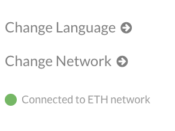

# Blockchain_HW
Blockchain Homework
##Creating a Genesis Block
###Puppeth & Proof of Work

##Import Dependencies MyCrypto ETH Wallet

##Configure Genesis Block (Chain ID 1234)

##Export JSON FILE (Puppernet.Json)

##Creating Nodes & Initializing JSON

###./geth account new --datadir node1
###./geth account new --datadir node2
###./geth init puppernet_config/puppernet.json --datadir node1

##Bringing Blockchain to Life (Mining)
###./geth --datadir node 1 --mine --minerthread1
###./geth --datadir node 2 --bootnodes "enode" --port30304 --rpc

###Ecode

#Sending Transactions (Walet)
##Crypto Wallet
###Opening Crypto Wallet to Configure the ETH Testnet

###Creating Puppernet ETH (Chain ID 1234)

###Keystone File

###Transfer Funds

###Sending ETH

